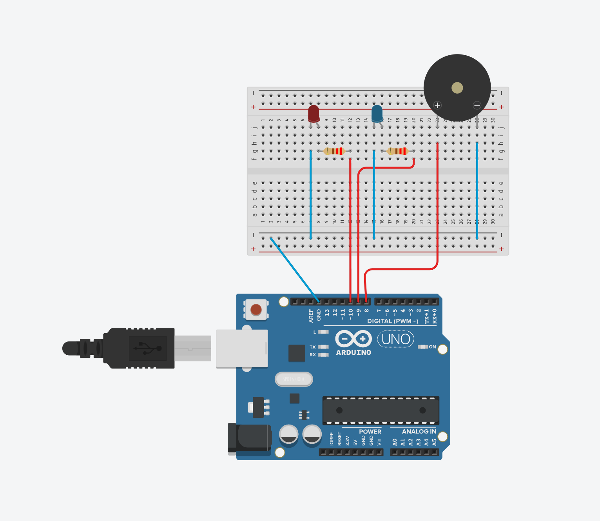

```cpp
int red = 10;
int blue = 9;
int busor = 8;

void setup()
{
  pinMode(red, OUTPUT);
  pinMode(blue,OUTPUT);
  pinMode(busor, OUTPUT);
}

void loop()
{
  tone(busor, 739.99);
  digitalWrite(red, HIGH);
  digitalWrite(blue,LOW);
  delay(1000); // Wait for 1000 millisecond(s)
  tone(busor,523.25);
  digitalWrite(red, LOW);
  digitalWrite(blue,HIGH);
  delay(1000); // Wait for 1000 millisecond(s)
}
```

