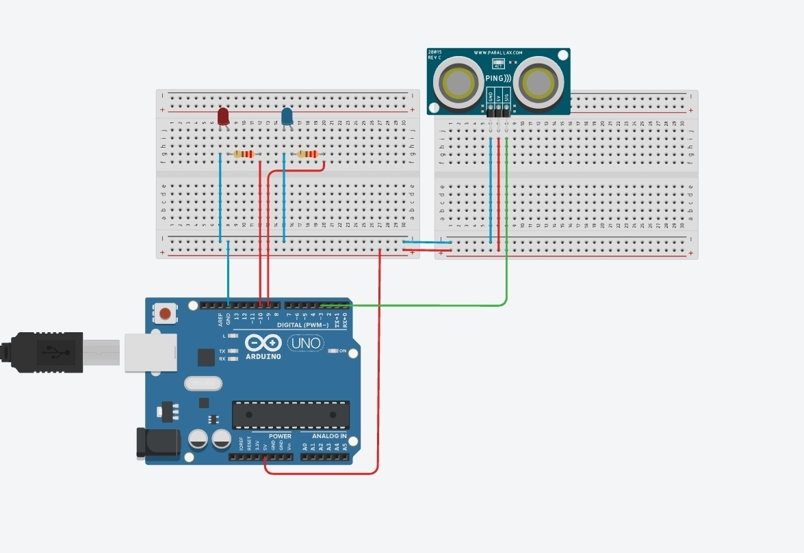

```cpp
int red = 10;
int blue = 9;
int freq = 3;

void setup()
{
  pinMode(red, OUTPUT);
  pinMode(blue,OUTPUT);
  Serial.begin(9600);
}

void loop()
{
  pinMode(freq,OUTPUT);
  digitalWrite(freq, LOW);
  delayMicroseconds(2);
  digitalWrite(freq,HIGH);
  delayMicroseconds(5);
  digitalWrite(freq,LOW);
  
  pinMode(freq,INPUT);
  double dur = pulseIn(freq,HIGH);
  double cm = dur * 340 /10000/2;
  
  Serial.println(cm);
  
  if(cm>250){
  	digitalWrite(red,HIGH);
    digitalWrite(blue,LOW);
  }
  else{
    digitalWrite(red,LOW);
    digitalWrite(blue,HIGH);
  }
  delay(1000);
}
